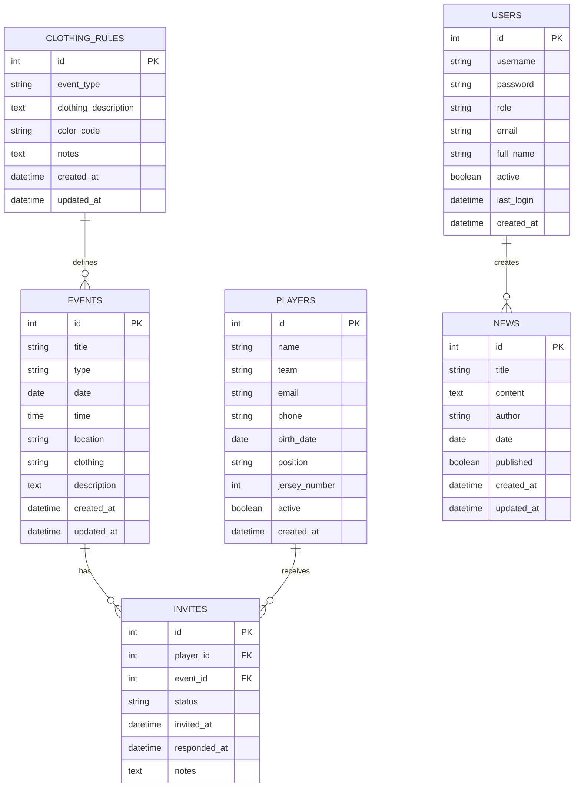

{: .label }
Technical Documentation

# Data Model

ClubConnect verwendet ein relationales Datenbankschema mit SQLite für die Entwicklung und PostgreSQL für die Produktion.

## 🗄️ Datenbankschema

### Entity Relationship Diagram



## 📊 Tabellen-Details

### Events Tabelle

**Zweck**: Speichert alle Vereinstermine (Training, Spiele, Turniere)

| Spalte | Typ | Beschreibung | Constraints |
|--------|-----|--------------|-------------|
| `id` | INTEGER | Primärschlüssel | PRIMARY KEY, AUTOINCREMENT |
| `title` | TEXT | Event-Titel | NOT NULL |
| `type` | TEXT | Event-Typ | NOT NULL |
| `date` | TEXT | Datum (YYYY-MM-DD) | NOT NULL |
| `time` | TEXT | Uhrzeit (HH:MM) | NOT NULL |
| `location` | TEXT | Veranstaltungsort | NOT NULL |
| `clothing` | TEXT | Kleidungsvorschrift | NOT NULL |
| `description` | TEXT | Detailbeschreibung | NULLABLE |
| `created_at` | TEXT | Erstellungszeitpunkt | DEFAULT CURRENT_TIMESTAMP |
| `updated_at` | TEXT | Letzte Änderung | DEFAULT CURRENT_TIMESTAMP |

**Event-Typen**:
- `Training` - Reguläres Training
- `Heimspiel` - Heimspiel
- `Auswärtsspiel` - Auswärtsspiel
- `Turnier` - Turnier/Wettkampf
- `Torwarttraining` - Spezielles Torwarttraining
- `Sonstiges` - Andere Veranstaltungen

**Beispiel-Daten**:
```sql
INSERT INTO events (title, type, date, time, location, clothing, description) 
VALUES (
    'Wochentraining', 
    'Training', 
    '2025-06-26', 
    '18:00', 
    'Sportplatz Hauptstraße',
    'Schwarze Hose, weißes Shirt',
    'Reguläres Wochentraining für alle Spieler'
);
```

### Players Tabelle

**Zweck**: Verwaltet alle Spielerinformationen

| Spalte | Typ | Beschreibung | Constraints |
|--------|-----|--------------|-------------|
| `id` | INTEGER | Primärschlüssel | PRIMARY KEY, AUTOINCREMENT |
| `name` | TEXT | Vollständiger Name | NOT NULL |
| `team` | TEXT | Mannschaft/Altersklasse | NOT NULL |
| `email` | TEXT | E-Mail-Adresse | NULLABLE |
| `phone` | TEXT | Telefonnummer | NULLABLE |
| `birth_date` | TEXT | Geburtsdatum | NULLABLE |
| `position` | TEXT | Spielposition | NULLABLE |
| `jersey_number` | INTEGER | Trikotnummer | NULLABLE |
| `active` | BOOLEAN | Aktiver Spieler | DEFAULT 1 |
| `created_at` | TEXT | Registrierungsdatum | DEFAULT CURRENT_TIMESTAMP |

**Teams/Altersklassen**:
- `U16` - Unter 16 Jahre
- `U18` - Unter 18 Jahre
- `U21` - Unter 21 Jahre
- `Herren` - Herrenmannschaft
- `Damen` - Damenmannschaft

**Positionen**:
- `Torwart` - Torhüter
- `Verteidiger` - Abwehrspieler
- `Mittelfeld` - Mittelfeldspieler
- `Stürmer` - Angreifer

**Beispiel-Daten**:
```sql
INSERT INTO players (name, team, email, phone, birth_date, position, jersey_number) 
VALUES (
    'Max Mustermann', 
    'U16', 
    'max.mustermann@email.de', 
    '0123-456789', 
    '2009-03-15', 
    'Stürmer', 
    9
);
```

### Invites Tabelle

**Zweck**: Verknüpft Spieler mit Events und verwaltet Einladungsstatus

| Spalte | Typ | Beschreibung | Constraints |
|--------|-----|--------------|-------------|
| `id` | INTEGER | Primärschlüssel | PRIMARY KEY, AUTOINCREMENT |
| `player_id` | INTEGER | Spieler-Referenz | FOREIGN KEY → players(id) |
| `event_id` | INTEGER | Event-Referenz | FOREIGN KEY → events(id) |
| `status` | TEXT | Einladungsstatus | NOT NULL, DEFAULT 'Eingeladen' |
| `invited_at` | TEXT | Einladungszeitpunkt | DEFAULT CURRENT_TIMESTAMP |
| `responded_at` | TEXT | Antwortzeit | NULLABLE |
| `notes` | TEXT | Notizen/Begründung | NULLABLE |

**Unique Constraint**: `UNIQUE(player_id, event_id)` - Ein Spieler kann nur einmal pro Event eingeladen werden

**Status-Werte**:
- `Eingeladen` - Einladung verschickt, keine Antwort
- `Bestätigt` - Teilnahme bestätigt
- `Entschuldigt` - Entschuldigt abgesagt
- `Fehlend` - Unentschuldigt gefehlt

**Beispiel-Daten**:
```sql
INSERT INTO invites (player_id, event_id, status, notes) 
VALUES (1, 1, 'Bestätigt', NULL);

INSERT INTO invites (player_id, event_id, status, notes) 
VALUES (2, 1, 'Entschuldigt', 'Krankheit');
```

### News Tabelle

**Zweck**: Vereinsnachrichten und Ankündigungen

| Spalte | Typ | Beschreibung | Constraints |
|--------|-----|--------------|-------------|
| `id` | INTEGER | Primärschlüssel | PRIMARY KEY, AUTOINCREMENT |
| `title` | TEXT | Nachrichtentitel | NOT NULL |
| `content` | TEXT | Nachrichteninhalt | NOT NULL |
| `author` | TEXT | Autor | DEFAULT 'Trainer' |
| `date` | TEXT | Veröffentlichungsdatum | NOT NULL |
| `published` | BOOLEAN | Veröffentlicht | DEFAULT 1 |
| `created_at` | TEXT | Erstellungszeitpunkt | DEFAULT CURRENT_TIMESTAMP |
| `updated_at` | TEXT | Letzte Bearbeitung | DEFAULT CURRENT_TIMESTAMP |

**Beispiel-Daten**:
```sql
INSERT INTO news (title, content, author, date) 
VALUES (
    'Saisonstart 2025', 
    'Die neue Saison beginnt am 26. Juni mit dem ersten Training...', 
    'Trainer Schmidt', 
    '2025-06-20'
);
```

### Clothing Rules Tabelle

**Zweck**: Definiert Kleidungsvorschriften für verschiedene Event-Typen

| Spalte | Typ | Beschreibung | Constraints |
|--------|-----|--------------|-------------|
| `id` | INTEGER | Primärschlüssel | PRIMARY KEY, AUTOINCREMENT |
| `event_type` | TEXT | Event-Typ | NOT NULL, UNIQUE |
| `clothing_description` | TEXT | Kleidungsbeschreibung | NOT NULL |
| `color_code` | TEXT | Farbcode (Hex) | NULLABLE |
| `notes` | TEXT | Zusätzliche Hinweise | NULLABLE |
| `created_at` | TEXT | Erstellungszeitpunkt | DEFAULT CURRENT_TIMESTAMP |
| `updated_at` | TEXT | Letzte Änderung | DEFAULT CURRENT_TIMESTAMP |

**Beispiel-Daten**:
```sql
INSERT INTO clothing_rules (event_type, clothing_description, color_code, notes) 
VALUES (
    'Training', 
    'Schwarze Hose, weißes Shirt, Sportschuhe mit Stollen', 
    '#000000', 
    'Für alle regulären Trainingseinheiten'
);
```

### Users Tabelle

**Zweck**: Benutzerkonten für Trainer und Administratoren

| Spalte | Typ | Beschreibung | Constraints |
|--------|-----|--------------|-------------|
| `id` | INTEGER | Primärschlüssel | PRIMARY KEY, AUTOINCREMENT |
| `username` | TEXT | Benutzername | UNIQUE, NOT NULL |
| `password` | TEXT | Passwort (Plain Text) | NOT NULL |
| `role` | TEXT | Benutzerrolle | NOT NULL, DEFAULT 'player' |
| `email` | TEXT | E-Mail-Adresse | NULLABLE |
| `full_name` | TEXT | Vollständiger Name | NULLABLE |
| `active` | BOOLEAN | Aktiver Account | DEFAULT 1 |
| `last_login` | TEXT | Letzter Login | NULLABLE |
| `created_at` | TEXT | Account-Erstellung | DEFAULT CURRENT_TIMESTAMP |

**Rollen**:
- `trainer` - Vollzugriff auf Admin-Bereich
- `player` - Nur Lesezugriff (zukünftige Erweiterung)

**Sicherheitshinweis**: In der aktuellen Version werden Passwörter im Klartext gespeichert. Für die Produktion sollte Hashing implementiert werden.

## 🔗 Beziehungen

### One-to-Many Beziehungen

**Events → Invites**:
- Ein Event kann viele Einladungen haben
- Eine Einladung gehört zu genau einem Event
- Cascade Delete: Beim Löschen eines Events werden alle Einladungen gelöscht

**Players → Invites**:
- Ein Spieler kann viele Einladungen erhalten
- Eine Einladung gehört zu genau einem Spieler
- Cascade Delete: Beim Löschen eines Spielers werden alle Einladungen gelöscht

### Many-to-Many Beziehung

**Players ↔ Events (über Invites)**:
- Spieler können zu mehreren Events eingeladen werden
- Events können mehrere Spieler haben
- Die Invites-Tabelle fungiert als Junction Table mit zusätzlichen Attributen

## 📈 Datenbank-Indizes

### Empfohlene Indizes für Performance:

```sql
-- Primärschlüssel (automatisch indiziert)
-- events(id), players(id), invites(id), news(id), clothing_rules(id), users(id)

-- Foreign Key Indizes
CREATE INDEX idx_invites_player_id ON invites(player_id);
CREATE INDEX idx_invites_event_id ON invites(event_id);

-- Häufig abgefragte Spalten
CREATE INDEX idx_events_date ON events(date);
CREATE INDEX idx_events_type ON events(type);
CREATE INDEX idx_players_team ON players(team);
CREATE INDEX idx_players_active ON players(active);
CREATE INDEX idx_news_published ON news(published);
CREATE INDEX idx_news_date ON news(date);

-- Composite Indizes
CREATE INDEX idx_invites_event_player ON invites(event_id, player_id);
CREATE INDEX idx_events_date_time ON events(date, time);
```

## 🔍 Häufige Queries

### Nächste Events abrufen:
```sql
SELECT * FROM events 
WHERE date >= date('now') 
ORDER BY date, time 
LIMIT 3;
```

### Einladungen für ein Event:
```sql
SELECT p.name, p.position, p.jersey_number, i.status, i.notes
FROM invites i
JOIN players p ON i.player_id = p.id
WHERE i.event_id = ?
ORDER BY p.name;
```

### Spieler-Statistiken:
```sql
SELECT 
    p.name,
    COUNT(i.id) as total_invites,
    SUM(CASE WHEN i.status = 'Bestätigt' THEN 1 ELSE 0 END) as confirmed,
    SUM(CASE WHEN i.status = 'Entschuldigt' THEN 1 ELSE 0 END) as excused,
    SUM(CASE WHEN i.status = 'Fehlend' THEN 1 ELSE 0 END) as missing
FROM players p
LEFT JOIN invites i ON p.id = i.player_id
WHERE p.active = 1
GROUP BY p.id, p.name
ORDER BY p.name;
```

## 🛠️ Datenbank-Verwaltung

### Initialisierung:
```bash
python init_db.py init
```

### Backup:
```bash
python init_db.py backup
```

### Reset:
```bash
python init_db.py reset
```

### Testdaten:
```bash
python seed.py
```

## 🔄 Migration Strategy

### Schema-Änderungen:
1. **Backup** der aktuellen Datenbank
2. **SQL-Script** für Schema-Änderungen
3. **Daten-Migration** falls nötig
4. **Testing** der neuen Struktur
5. **Rollback-Plan** vorbereiten

### Beispiel Migration:
```sql
-- Neue Spalte hinzufügen
ALTER TABLE players ADD COLUMN profile_image TEXT;

-- Index erstellen
CREATE INDEX idx_players_profile_image ON players(profile_image);

-- Daten aktualisieren
UPDATE players SET profile_image = 'default.png' WHERE profile_image IS NULL;
```

---

Dieses Datenmodell bietet eine solide Grundlage für die ClubConnect-Anwendung und kann bei Bedarf erweitert werden.
